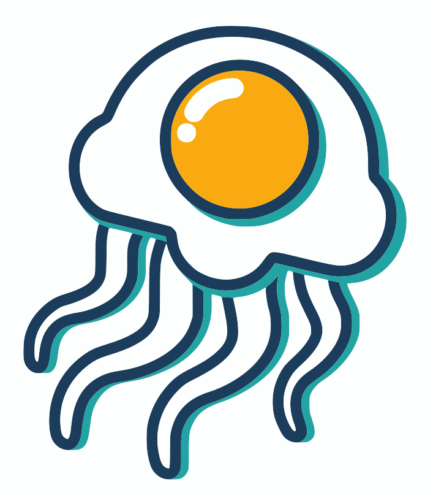

# friedegg

**Real-time visual monitoring for code-built automations.**

When you build automations with AI coding tools, the workflow becomes invisible — no flowchart, no status indicators, no way to see what's running or what failed. `friedegg` gives you that visual layer back.

Add four lines to your script. Open the dashboard. Watch your automation glow.

---

<!-- dashboard screenshot -->
<!-- TODO: add screenshot after first real demo run -->

---

## Install

```
pip install friedegg
```

Requires Python 3.10+.

## Quick start

**1. Add monitoring to your script:**

```python
from friedegg import monitor

monitor.start("Daily Lead Report")
monitor.step("Connect to HubSpot API")
monitor.step("Pull new leads")
monitor.step("Send summary email")
monitor.done()
```

**2. Launch the dashboard in a separate terminal:**

```
friedegg dashboard
```

Your browser opens at `http://127.0.0.1:8765`. Run your script — each step appears in real time.

## Error reporting

```python
try:
    pull_leads()
except Exception as e:
    monitor.error("Failed to pull leads", details=str(e))
```

The dashboard displays the error in plain English alongside the failed step.

## API reference

### `monitor.start(workflow_name, description=None, ws_url=...)`

Begins a new monitored workflow run. Call this once at the top of your script.

| Parameter | Type | Description |
|-----------|------|-------------|
| `workflow_name` | `str` | Name shown in the dashboard header |
| `description` | `str \| None` | Optional subtitle |
| `ws_url` | `str` | Dashboard WebSocket URL (default: `ws://127.0.0.1:8765/ws/ingest`) |

Returns the `run_id` string (UUID). You can ignore it.

---

### `monitor.step(step_name, status="done", metadata=None)`

Marks a step in the workflow. Call once per step as it completes.

| Parameter | Type | Description |
|-----------|------|-------------|
| `step_name` | `str` | Label shown on the dashboard node |
| `status` | `str` | `"done"` (default) or `"running"` |
| `metadata` | `dict \| None` | Optional key/value pairs attached to the step |

Auto-timing: `friedegg` measures how long each step took and displays the duration.

---

### `monitor.error(message, details=None, step_name=None)`

Reports an error on the current or named step.

| Parameter | Type | Description |
|-----------|------|-------------|
| `message` | `str` | Plain-English description of what failed |
| `details` | `str \| None` | Full traceback or extra context (auto-captured if omitted) |
| `step_name` | `str \| None` | Which step failed (defaults to the last active step) |

---

### `monitor.done()`

Marks the workflow complete. Always call this at the end of your script.

---

## Dashboard CLI

```
friedegg dashboard [--host HOST] [--port PORT] [--no-browser] [--log-level LEVEL]
```

| Flag | Default | Description |
|------|---------|-------------|
| `--host` | `127.0.0.1` | Bind address |
| `--port` | `8765` | Port |
| `--no-browser` | off | Skip auto-opening the browser |
| `--log-level` | `warning` | Server verbosity (`debug`, `info`, `warning`, `error`, `critical`) |

## Silent fail

If the dashboard isn't running when your script starts, `friedegg` logs a single warning and your automation continues normally. Nothing breaks.

## How it works

```
your script  →  WebSocket (localhost)  →  FEJ server  →  browser dashboard
```

All data stays on your machine. Nothing is sent to any external service.

## License

MIT. See [LICENSE](LICENSE).

## Attribution

Built by [Kenneth Ebilane](https://github.com/kenebi) / [AVI Lane Digital](https://avilane.com).
