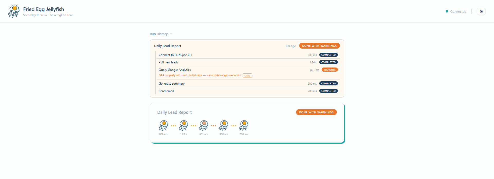
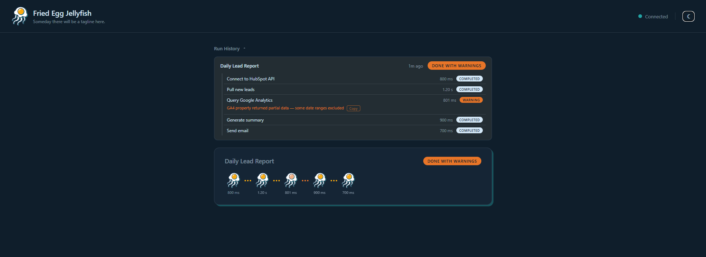

# Fried Egg Jellyfish

**Real-time visual monitoring for code-built automations.**

When you build automations with AI coding tools, the workflow becomes invisible — no flowchart, no status indicators, no way to see what's running or what failed. `friedeggjellyfish` gives you that visual layer back.

Add four lines to your script. Open the dashboard. Watch your automation glow.

---

## Install

```
pip install friedeggjellyfish
```

Requires Python 3.10+.

---

## Quickstart

```python
from friedeggjellyfish import monitor

monitor.start("Daily Lead Report")
monitor.step("Connect to HubSpot API")
monitor.step("Pull new leads")
monitor.step("Send summary email")
monitor.done()
```

Then in a separate terminal:

```
friedeggjellyfish dashboard
```

Your browser opens at `http://127.0.0.1:8765`. Run your script — each step appears in real time.

---

## What it looks like





Each step in your automation becomes a jellyfish node on a live timeline. Colors tell you the state at a glance:

| Color | Meaning |
|-------|---------|
| Gray / faded | Step is running |
| Gold | Step completed successfully |
| Burnt orange | Step completed with a warning |
| Red | Step hit an error |

The dashboard updates over WebSocket as your script runs — no refresh needed.

---

## Next steps

- [Getting Started](getting-started.md) — full setup walkthrough
- [API Reference](api-reference.md) — all methods and CLI flags
- [Examples](examples.md) — real automation scripts you can run today
